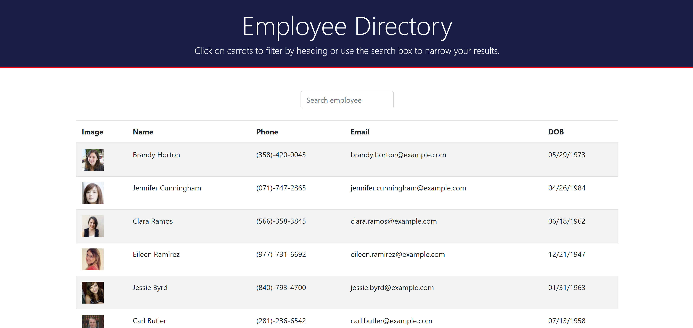

## Description
This project was bootstrapped with [Create React App](https://github.com/facebook/create-react-app). This application is an employee directory where the user can see the entire employee directory at once. The user can also filter the directory by typing the employee's name, and sort the directory by clicking on the name column.

## Available Scripts

In the project directory, you can run:

### `npm start`

Runs the app in the development mode.

## Demonstration

You can see the deployed app in the following link: 

https://acc24.github.io/Employee-Directory/
 

